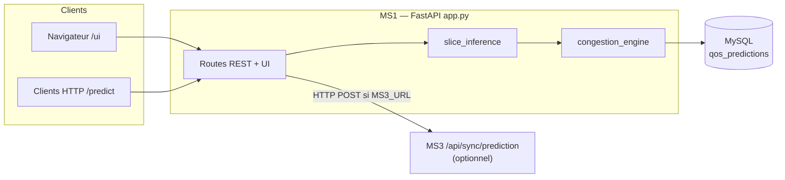

# MS1 — Prédiction QoS (fichier `app.py`)

Service FastAPI qui calcule le **score QoS**, la **congestion** (faible / moyenne / forte) et enregistre les résultats en base. Il peut **notifier MS3** après une prédiction réussie.

## Architecture (MS1)

MS1 est le **point d’entrée métier** pour la prédiction QoS : l’UI et les clients API envoient des métriques réseau ; le service enchaîne l’inférence ML et le moteur de congestion, persiste dans MySQL, puis peut pousser un résumé vers MS3 pour le NOC.

## Types de slices 5G : eMBB, mMTC et URLLC

En 5G, le **network slicing** permet de virtualiser le réseau en **tranches** adaptées à des usages différents. La norme (famille 3GPP) distingue surtout trois **types de service** — ce projet les note en interne **`1` = eMBB**, **`2` = mMTC**, **`3` = URLLC** (voir `slice_inference.py`, `scripts/train_models.py`, moteur de congestion).

| Type | Nom complet | À quoi ça sert (idée simple) | Exigences typiques |
|------|-------------|------------------------------|-------------------|
| **eMBB** | *enhanced Mobile Broadband* | Débit élevé : vidéo, téléchargements, expérience mobile « grand public » | Priorité au **débit** et à la capacité ; latence et fiabilité **moins strictes** que pour l’industrie temps réel. |
| **mMTC** | *massive Machine-Type Communications* | Très nombreux objets **simples** : capteurs, compteurs, IoT à faible débit | Beaucoup de connexions, souvent **faible débit** par appareil, coût / énergie importants ; pas l’ultra-faible latence. |
| **URLLC** | *Ultra-Reliable Low-Latency Communications* | Cas **critiques** : robotique, automation industrielle, certaines applications nécessitant réaction très rapide et très peu d’erreurs | **Latence très basse** et **très haute fiabilité** (peu de pertes) — c’est pourquoi, dans ce dépôt, les plafonds SLA pour le profil `3` / `URLLC` sont les plus sévères. |

Une même mesure (par ex. délai ou taux de perte) peut être **acceptable** pour eMBB ou mMTC mais **inacceptable** pour URLLC : d’où l’intérêt de lier **congestion**, **SLA** et **prédiction de slice** au bon profil.

## Drapeaux service (0 / 1) — formulaire UI et `QoSPredictRequest`

Champs binaires **alignés sur le dataset d’entraînement** (`scripts/train_models.py` / `slice_inference.build_engineered_feature_row`). Ils construisent les colonnes catégorielles du vecteur ML et des features dérivées (**`Is_Critical`**, **`Is_IoT_Service`**, **`QoS_Score`**). Valeur **`0`** = absent / non, **`1`** = présent / oui.

| Champ API / formulaire | Rôle (résumé) |
|------------------------|----------------|
| `lte_5g` | Usage LTE ou 5G (feature « LTE/5G »). Peut aussi être déduit si `lte5g_cat` ≠ 0 alors que `lte_5g` = 0. |
| `gbr` | Service à débit garanti (GBR). |
| `ar_vr_gaming` | Segment AR / VR / jeu. |
| `healthcare` | Santé — entre dans **`Is_Critical`** avec sécurité publique et transport. |
| `industry_4_0` | Industrie 4.0 — avec IoT et smart city, alimente **`Is_IoT_Service`**. |
| `iot_devices` | Objets / capteurs IoT — **`Is_IoT_Service`**. |
| `public_safety` | Sécurité publique — **`Is_Critical`**. |
| `smart_city_home` | Ville / maison connectée — **`Is_IoT_Service`**. |
| `smart_transportation` | Transport intelligent — **`Is_Critical`**. |
| `smartphone` | Usage smartphone grand public. |

**Important :** ces drapeaux **influencent surtout la prédiction de type de slice** (RF / XGB / MLP) et le détail `slice_ml` ; le **niveau de congestion** reste piloté par délai, PLR, jitter, profil congestion, etc. (`congestion_engine`), pas par un seul drapeau à lui seul.

**Où c’est déjà expliqué pour le parcours test :** même contenu, avec les valeurs par défaut du formulaire, dans **`7 WORKFLOW_TEST_GUIDE.md`** §**3.2**.

## Modèles ML — quand utilise-t-on RF, XGBoost, MLP et les autres ?

### Random Forest, XGBoost, MLP (MS1 — `slice_inference.py`)

Ils servent tous les trois à la **même tâche** : prédire le **type de slice** (classe `1|2|3` ↔ eMBB / mMTC / URLLC) à partir des métriques et drapeaux métier, avec le même jeu de colonnes que l’entraînement (`ml/features.pkl`).

| Modèle | Entraînement | Inférence MS1 |
|--------|----------------|----------------|
| **Random Forest** | `scripts/train_models.py` → `ml/rf_model.pkl` | **Toujours** si les artefacts sont présents (`features.pkl` + `rf_model.pkl` sont le minimum requis). |
| **XGBoost** | idem → `ml/xgb_model.pkl` | **Si le fichier existe** : prédiction en plus, résultat dans le détail ML (`xgb_class`). |
| **MLP** | idem → `ml/mlp_model.pkl` | **Si** `mlp_model.pkl` **et** `scaler.pkl` existent : prédiction sur données **normalisées** (`mlp_class`). |

**Rôle dans la réponse API MS1** (`app.py`) :

- Le champ **`predicted_slice_type` / label** affiché côté QoS utilise **uniquement la sortie du Random Forest** (`rf_class`), pas XGB ni MLP.
- La clé **`congestion_slice_profile`** (SLA + seuils congestion) est : **`slice_type` explicite dans la requête** si le client l’envoie ; sinon **la classe RF** ; si pas d’artefacts / échec RF → repli sur `slice_type_hint` ou défaut **`"2"`** (mMTC). Les classes **XGB et MLP ne choisissent pas** ce profil lorsque le RF a réussi.
- XGB et MLP sont donc surtout utiles pour **comparaison**, **qualité**, **démo** ou analyses dans `congestion_detail` / `slice_ml`, pas pour piloter la congestion tant que la logique actuelle ne les privilégie pas.

### Isolation Forest + autoencodeur Keras (MS2 — `anomaly/`, `ml/inference.py`)

Ce n’est **pas** de la classification de slice : c’est de la **détection d’anomalies** sur les métriques. Entraînés / exportés dans `train_models.py` (IF + modèle `.h5`), ils sont utilisés quand on appelle le service **MS2** (`POST /api/anomaly/detect`), pas dans le flux principal MS1 `/predict/qos/5g`.

### Récap des fichiers

| Fichier / service | Modèles |
|-------------------|--------|
| `scripts/train_models.py` | Entraîne RF, XGB, MLP, Isolation Forest (+ autoencodeur pour MS2), enregistre sous `ml/`, MLflow optionnel |
| `slice_inference.py` | Charge les `.pkl` et exécute RF (+ XGB/MLP si présents) |
| `app.py` (MS1) | Enchaîne `predict_slice_models` puis `congestion_engine` |
| `anomaly/app.py` (MS2) | Autoencodeur + IF via `detect_anomaly` |

## Congestion — qu’est-ce que c’est, pourquoi, et quand ?

Dans ce dépôt, la **congestion** n’est pas un modèle ML : c’est une **classification opérationnelle** de l’état de charge du slice, calculée par règles dans `congestion_engine.py` à partir de KPIs réseau. Elle produit un niveau API **`Low` / `Medium` / `High`** (aligné notebook), affiché côté opérateur comme **Normal / Light / Critical** (`congestion_display`).

### Pourquoi en avoir besoin

- **Network slicing** : eMBB, mMTC et URLLC n’ont pas les mêmes contraintes (délai, taux de perte). Une même latence peut être acceptable pour un profil et **critique** pour un autre. Le moteur normalise délai et PLR par rapport à des **plafonds SLA par type de tranche**, puis agrège plusieurs signaux (jitter, stress capacité/débit, mobilité) en un **indice de pression** entre 0 et 100.
- **Décision et traçabilité** : la sévérité alimente le **flag `sla_respected`** (ici : SLA considérée violée si congestion `High`), le **score QoS dérivé** (`qos_from_pressure`), l’**historique** en base (`qos_predictions.congestion_level`) et les **vues NOC** (MS3 peut recevoir une synchro après prédiction).
- **Réglage terrain** : les seuils qui transforment la pression en `Low`/`Medium`/`High` peuvent être ajustés par JSON d’environnement ou, si activé, par la table MySQL `operator_thresholds` (CRUD MS3), ce qui relie l’exploitation aux règles sans retoucher le code.

### Comment c’est appliqué dans MS1 (flux)

À **chaque prédiction** qui passe par `_run_prediction()` dans `app.py` :

1. `slice_inference.predict_slice_models` fournit le contexte ML et une **clé de profil congestion** (`"1"` \| `"2"` \| `"3"`, cohérente avec le type de slice pour les SLA).
2. `classify_congestion(...)` calcule pression + niveau à partir du corps de requête : `delay`, `plr`, `jitter`, `demand_mbps`, `capacity_mbps`, `mobility_stress`.
3. `qos_from_pressure` déduit `qos_score`, `qos_risk_score`, `risk_tier`, etc.
4. Le résultat est **persisté** en MySQL, puis **MS3** peut être notifié (POST vers `/api/sync/prediction`) si `MS3_URL` est défini.

Concrètement, ce flux est utilisé pour : **`POST /predict/qos/5g`**, **`POST /predict/congestion`**, les soumissions **`POST /ui/predict`** (modes 5G ou congestion), et les endpoints qui réutilisent la même chaîne (ex. export / historique alimentés par les lignes déjà calculées). La doc OpenAPI (`/docs`) décrit les champs de réponse (`congestion_level`, `congestion_display`, `pressure_index`, `congestion_detail`, `congestion_slice_profile`).

### Fichiers et configuration utiles

| Élément | Rôle |
|--------|------|
| `congestion_engine.py` | Indice de pression, seuils par profil, `classify_congestion`, `qos_from_pressure`, fusion optionnelle DB |
| `app.py` | Orchestration `_run_prediction`, routes prédiction/UI, persistance, sync MS3 |
| `slice_inference.py` | Choix de la clé de profil utilisée par le moteur de congestion |
| Variables d’environnement | `CONGESTION_THRESHOLDS_JSON`, `CONGESTION_SLA_REFS_JSON`, `CONGESTION_THRESHOLDS_FROM_DB`, `CONGESTION_JITTER_REF_MS` (voir `.env.example`) |

## Routes HTTP (méthodes exposées)

| Méthode | Chemin | Rôle (simple) |
|--------|--------|----------------|
| GET | `/health` | Vérifie que le service répond (état « healthy »). |
| POST | `/predict/qos/5g` | **Prédiction principale** : envoie les métriques (PLR, délai, flags de service, etc.) → reçoit QoS, congestion, SLA, etc. Sauvegarde en base et tente d’avertir MS3. |
| POST | `/predict/congestion` | Même moteur que ci-dessus, avec un libellé de pipeline orienté « congestion » (utile pour certains flux). |
| GET | `/predict/stats` | Statistiques SQL : nombre total de prédictions et **taux de conformité SLA**. |
| GET | `/` | Résumé JSON du service (nom, version, liens vers la doc OpenAPI). |

## Interface web (UI)

| Méthode | Chemin | Rôle (simple) |
|--------|--------|----------------|
| GET | `/ui` | Redirige vers le tableau de bord UI. |
| GET | `/ui/dashboard` | Page HTML : formulaire de prédiction, dernier résultat, graphique. |
| POST | `/ui/predict` | Soumission du formulaire : lance une prédiction (mode 5G ou congestion) et réaffiche le tableau de bord. |
| GET | `/ui/history` | Historique HTML des dernières prédictions (jusqu’à 500 lignes). |
| GET | `/ui/export.csv` | Télécharge un fichier CSV des prédictions récentes. |
| GET | `/api/ui/chart-series` | Données JSON (timestamps + scores QoS) pour alimenter le graphique. |

## Fonctions internes utiles (non exposées en HTTP)

- **`get_db_connection()`** : ouvre une connexion MySQL avec la configuration du conteneur / `.env`.
- **`_run_prediction(body, pipeline_label)`** : enchaîne le ML (`slice_inference`), la classification de congestion (`congestion_engine`) et le calcul QoS.
- **`_persist_prediction(...)`** : écrit une ligne dans la table `qos_predictions`.
- **`_notify_ms3_sync(payload)`** : envoie en option un POST vers MS3 (`/api/sync/prediction`) si `MS3_URL` est défini.

Pour le détail des champs JSON, ouvrir la doc interactive du service : `/docs`.
