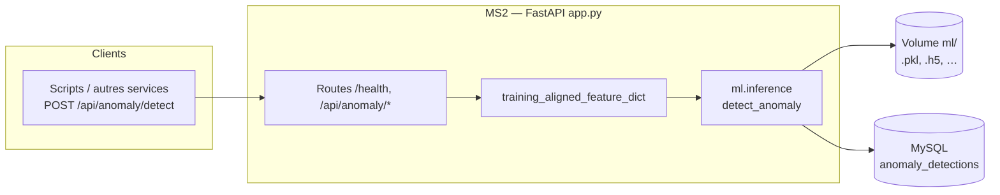

# MS2 — Détection d’anomalies (fichier `app.py`)

Service FastAPI qui reçoit des **métriques réseau** et des **indicateurs de type de trafic** (0/1), calcule si la situation est **anormale** (score + confiance), puis **enregistre** le résultat en base.

## Architecture (MS2)

MS2 est un service **stateless côté API** : il transforme un vecteur de features aligné sur l’entraînement en verdict d’anomalie via `ml.inference` (modèles sous `ml/` dans le conteneur), puis journalise chaque contrôle dans MySQL. Les tableaux de bord (MS3) lisent ensuite ces lignes.

## Routes HTTP

| Méthode | Chemin | Rôle (simple) |
|--------|--------|----------------|
| GET | `/health` | Contrôle que le service est vivant. |
| POST | `/api/anomaly/detect` | **Cœur du service** : corps JSON avec `slice_id`, perte de paquets, délai, et les flags (LTE/5G, IoT, etc.). Réponse : `is_anomaly`, `score`, `confidence`, `method` (+ détail optionnel). Insertion dans `anomaly_detections`. |
| GET | `/api/anomaly/stats` | Agrégats sur les **N derniers jours** (paramètre `days`, entre 1 et 365, défaut 7) : total de contrôles, nombre d’anomalies, scores moyens. |
| GET | `/` | Métadonnées du service et liste des endpoints. |

## Logique métier (résumé)

La route `/api/anomaly/detect` appelle d’abord **`training_aligned_feature_dict`** pour aligner les champs sur l’entraînement, puis **`detect_anomaly`** (module `ml.inference`) pour obtenir le verdict et les scores.

Pour les schémas exacts de requête/réponse, utiliser `/docs` sur l’instance MS2.
