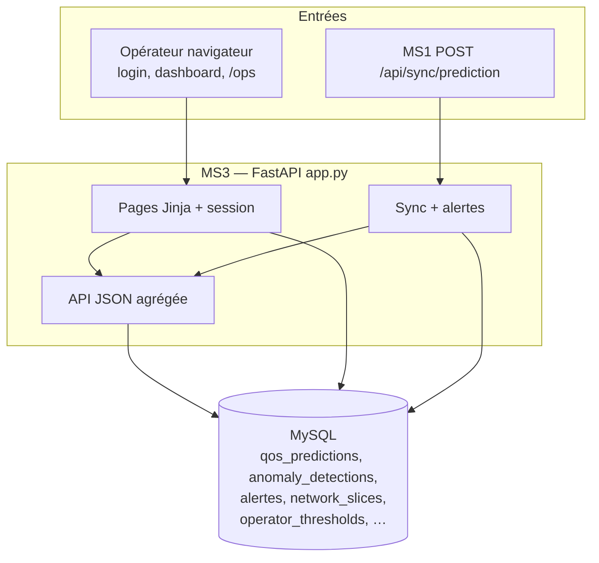

# MS3 — Tableau de bord / NOC (fichier `app.py`)

Service FastAPI qui **agrège** des données (prédictions QoS, anomalies, alertes) et fournit une **interface web** avec **session** (login / logout). Certaines routes API sont **sans authentification** pour les intégrations automatiques (ex. MS1).

## Architecture (MS3)

MS3 est la **couche supervision / NOC** : il lit les tables alimentées par MS1 et MS2, gère les entités opérateur (tranches, seuils) et les alertes, et expose une UI sessionnée. MS1 peut appeler une route de sync **sans cookie** pour alimenter le tableau de bord et déclencher des alertes critiques.

## Authentification et pages HTML

| Méthode | Chemin | Rôle (simple) |
|--------|--------|----------------|
| GET | `/login` | Affiche le formulaire de connexion (ou redirige vers le tableau de bord si déjà connecté). |
| POST | `/login` | Vérifie identifiant / mot de passe ; crée la session ou affiche une erreur. |
| GET | `/logout` | Vide la session et renvoie vers la page de login. |
| GET | `/dashboard` | **Tableau de bord principal** (nécessite une session) : statistiques agrégées. |
| GET | `/` | Redirige vers `/dashboard` (puis login si besoin). |
| GET | `/ops` | Page **opérations** : tranches réseau, seuils opérateur, alertes récentes (session requise). |

## Formulaires opérateur (`/ops`)

| Méthode | Chemin | Rôle (simple) |
|--------|--------|----------------|
| POST | `/ops/slices/add` | Ajoute ou met à jour une tranche (`slice_key`, nom affiché, type, notes). |
| POST | `/ops/slices/delete/{row_id}` | Supprime une ligne de `network_slices`. |
| POST | `/ops/thresholds/save` | Enregistre les seuils de pression (profil + bornes basse/moyenne). |
| POST | `/ops/alerts/ack` | Marque une alerte comme **prise en compte** (formulaire avec `alert_id`). |

## API (JSON)

| Méthode | Chemin | Rôle (simple) |
|--------|--------|----------------|
| GET | `/health` | Santé du service. |
| POST | `/api/sync/prediction` | **Appelé par MS1** : enregistre un log ; si congestion « High », peut **créer une alerte critique**. |
| GET | `/api/dashboard-data` | Retourne le même paquet de données que le tableau de bord (pour scripts ou tests). |
| GET | `/api/alerts` | Liste les alertes (paramètre `limit`, plafonné). |
| POST | `/api/alerts/{alert_id}/acknowledge` | Marque une alerte comme acquittée via l’API (JSON). |

## Fonctions internes utiles

- **`get_db_connection()`** : connexion MySQL.
- **`ensure_operator_schema()`** : crée au besoin les tables `network_slices` et `operator_thresholds`.
- **`fetch_dashboard_payload()`** : assemble prédictions, anomalies et alertes pour l’affichage.

Détails des champs : `/docs` sur MS3.
