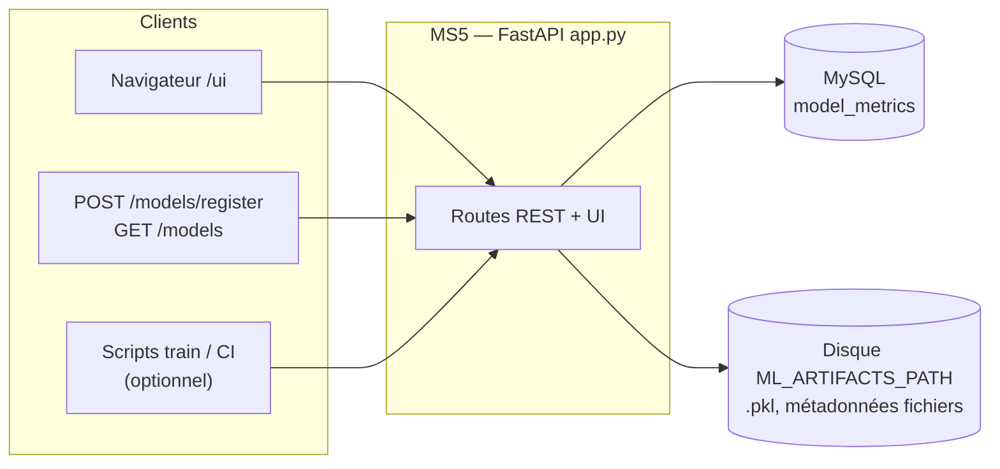

# MS5 — Registre des modèles ML (fichier `app.py`)

Service FastAPI qui sert de **carnet d’enregistrement** des modèles : métriques en base (`model_metrics`) et **fichiers** présents sur disque (artefacts ML montés dans le conteneur).

## Architecture (MS5)

MS5 est le **registre MLOps** du projet : l’API et la petite UI listent les métadonnées SQL et croisent avec le contenu du répertoire d’artefacts (volume Docker). Les pipelines d’entraînement ou les opérateurs peuvent enregistrer de nouvelles versions sans passer par les services d’inférence MS1/MS2.

## Routes HTTP

| Méthode | Chemin | Rôle (simple) |
|--------|--------|----------------|
| GET | `/health` | Vérifie que le service répond. |
| GET | `/models` | Liste les **modèles enregistrés** en base + découverte des **fichiers** (artefacts) et métadonnées associées sur disque. |
| POST | `/models/register` | **Enregistre** un nouveau modèle : nom, version, accuracy, precision, recall, F1, ROC-AUC, etc. (champs optionnels selon le corps JSON). |
| GET | `/models/{model_id}/metrics` | Détail d’**une** ligne du registre (par identifiant numérique). Erreur 404 si inconnu. |
| GET | `/ui` | Page HTML de **tableau de bord** : affichage des modèles et des artefacts. |
| GET | `/` | Infos service + liste des endpoints principaux. |

## Note pratique

Les lignes en base peuvent être créées par cette API ou par des scripts d’entraînement si MS5 est joignable à la fin du pipeline. Le disque (`ML_ARTIFACTS_PATH`) montre ce qui est réellement présent comme fichiers `.pkl` ou similaires.

Schémas précis : `/docs` sur MS5.
